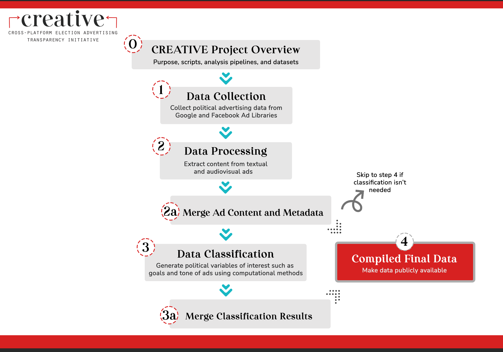

# Wesleyan Media Project - Issue Classifier

Welcome! This repository contains scripts that are trained on 2018 and 2020 ads, meant to classify issues contained within uncoded 2022 ads.

This repo is a part of the [Cross-platform Election Advertising Transparency Initiative (CREATIVE)](https://www.creativewmp.com/). CREATIVE is an academic research project that has the goal of providing the public with analysis tools for more transparency of political ads across online platforms. In particular, CREATIVE provides cross-platform integration and standardization of political ads collected from Google and Facebook. CREATIVE is a joint project of the [Wesleyan Media Project (WMP)](https://mediaproject.wesleyan.edu/) and the [privacy-tech-lab](https://privacytechlab.org/) at [Wesleyan University](https://www.wesleyan.edu).

To analyze the different dimensions of political ad transparency we have developed an analysis pipeline. The scripts in this repo are part of the Compiled Final Data Step in our pipeline.


You will also need the repos [datasets](https://github.com/Wesleyan-Media-Project/datasets) to run the scripts. Some parts of the data in the datasets repo include the TV data. Due to contractual reasons, users must apply directly to receive raw TV data. Visit [here](http://mediaproject.wesleyan.edu/dataaccess) and fill out the online request form to access the TV datasets.

## Table of Contents

- [1. Overview](#1-overview)
- [2. Setup](#2-setup)
- [3. Results Storage](#3-results-storage)
- [4. Thank You](#4-thank-you)

## 1. Overview

The issue classifier, trained on 2018 and 2020 ads - both TV and Facebook - is designed to be applied to uncoded 2022 ads. It is based on issues as coded by the WMP.

Given that an ad can have multiple issues - or none - there are two basic approaches. One is to use a binary classifier for each issue separately, and the other to use a multilabel classifier which processes all issues together. The binary classifiers tend to have higher precision but lower recall, while the multilabel classifiers tend to have lower precision and higher recall. The multilabel classifiers have higher F1 scores. All measures noted here are only for the 1s of each class as predicting the 0s all the time would yield something like 97-98% accuracy, meaning that it is in a sense easy.

The 2018 WMP coding is missing a few of the issues that were coded in 2020. Furthermore, some of the ads are missing random issues. Due to both of these problems, we do imputation by training binary classifiers for each issue with missing data. The binary classifiers are improved as a result of this this since we want to be cautious and err on the side of more 0s, and we want to use as much data for imputation as we can. In addition, the multilabel model can only use the ads for which no issues are missing, even if those other issues do not matter for imputing for just one issue.

Imputation is done by training models on Facebook data and then imputing the missing Facebook data, and training models on TV data and then imputing the missing TV data. With this in mind, the two types of media are handled separately for imputing.

For the final model, to be used for inference, we use a transformer-based multilabel model, mostly based on the [code](https://dataverse.harvard.edu/dataset.xhtml?persistentId=doi:10.7910/DVN/C9SAIX) by a recent [Political Analysis article](https://www.cambridge.org/core/journals/political-analysis/article/creating-and-comparing-dictionary-word-embedding-and-transformerbased-models-to-measure-discrete-emotions-in-german-political-text/2DA41C0F09DE1CA600B3DCC647302637#article). That paper is based on German data however, and so here a Distilbert is used instead of the German Electra used there.

## 2. Setup

### 1. Install R and Packages

1. First, make sure you have R installed. While R can be run from the terminal, many people find it much easier to use r-studio along with R. [Here](https://rstudio-education.github.io/hopr/starting.html) is a link that walks you through downloading and using both programs. The scripts use R (4.0.1).

2. Next, make sure you have the following packages installed in R (the exact version we used of each package is listed in the [requirements_r.txt file](https://github.com/Wesleyan-Media-Project/ad_goal_classifier/blob/main/requirements_r.txt)). You can install by calling:

   ```R
   install.packages('data.table')
   install.packages("stringr")
   install.packages("haven")
   install.packages("dplyr")
   install.packages("tidyr")
   ```

3. In order to successfully run each R script, you must first set your working directory. You can achieve this by adding the line `setwd("your/working/directory")` to the top of the R scripts, replacing `"your/working/directory"` with whatever directory you are running from. Additionally, make sure that the locations to which you are retrieving input files and/or sending output files are accurate.

4. In order to execute an R script, you can run the following code from your command-line, replacing `file.R` with the necessary file name/location:

   ```bash
   Rscript file.R
   ```

### 2. Install Python and Packages

1. First, make sure you have [Python](https://www.python.org/) installed. The scripts use Python (3.9.16).

2. In addition, make sure you have the following packages installed in Python (the exact version we used of each package is listed in the [requirements_r.txt file](https://github.com/Wesleyan-Media-Project/ad_goal_classifier/blob/main/requirements_py.txt)). You can install by running the following in your command-line:

   ```bash
   pip install pandas
   pip install scikit-learn
   pip install numpy
   pip install joblib
   pip install transformers
   pip install torch
   ```

3. In order to execute a python script, you can run the following code from your command-line, replacing `file.py` with the necessary file name/location:

   ```bash
   python3 file.py
   ```

### 3. Install Jupyter Notebook

1. Install Jupyter Notebook by writing the following command in your terminal:

   ```bash
   pip install jupyter
   ```

2. From here, you should be able to run Jupyter Notebook by entering this command in your terminal:

   ```bash
   jupyter notebook
   ```

**NOTE**: Files in this repo numbered 01 through 21 use TV data. We are contractually unable to share this data through Github, but you can request access to this data by following the steps laid out [at this link](https://mediaproject.wesleyan.edu/dataaccess/).

## 3. Results Storage

The data created by the scripts in this repo is in `csv` format. They are stored in different folders based on different categories. For example, the performance data is stored in `/performance` folder. It contains the performance of the binary classifier and the multilabel classifier which processes all issues together.

To decide which issues to classify, we looked at which issues occurred at least 100 times in the TV data, and excluded two (Issue 116 and 209) that were problematic. So we have 65 issues. The file `data/issues_of_interest.csv` contains the list this is based on.

## 4. Thank You

<p align="center"><strong>We would like to thank our financial supporters!</strong></p><br>

<p align="center">This material is based upon work supported by the National Science Foundation under Grant Numbers 2235006, 2235007, and 2235008.</p>

<p align="center" style="display: flex; justify-content: center; align-items: center;">
  <a href="https://www.nsf.gov/awardsearch/showAward?AWD_ID=2235006">
    
  </a>
</p>

<p align="center">The Cross-Platform Election Advertising Transparency Initiative (CREATIVE) is a joint infrastructure project of the Wesleyan Media Project and privacy-tech-lab at Wesleyan University in Connecticut.

<p align="center" style="display: flex; justify-content: center; align-items: center;">
  <a href="https://www.creativewmp.com/">
    
  </a>
</p>

<p align="center" style="display: flex; justify-content: center; align-items: center;">
  <a href="https://mediaproject.wesleyan.edu/">
    
  </a>
</p>

<p align="center" style="display: flex; justify-content: center; align-items: center;">
  <a href="https://privacytechlab.org/" style="margin-right: 20px;">
    
  </a>
</p>
