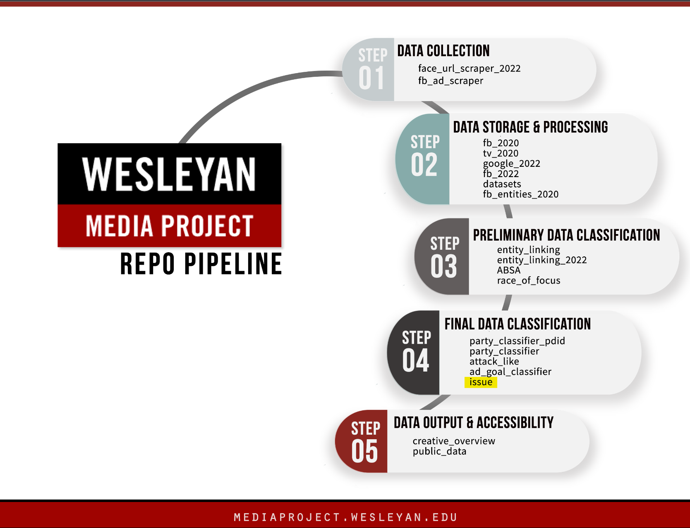

# CREATIVE --- Issue Classifier

Welcome! This repo contains scripts for classifying issues in political ads that are trained on hand-coded 2018 and 2020 advertising data.

This repo is part of the [Cross-platform Election Advertising Transparency Initiative (CREATIVE)](https://www.creativewmp.com/). CREATIVE is an academic research project that has the goal of providing the public with analysis tools for more transparency of political ads across online platforms. In particular, CREATIVE provides cross-platform integration and standardization of political ads collected from Google and Facebook. CREATIVE is a joint project of the [Wesleyan Media Project (WMP)](https://mediaproject.wesleyan.edu/) and the [privacy-tech-lab](https://privacytechlab.org/) at [Wesleyan University](https://www.wesleyan.edu).

To analyze the different dimensions of political ad transparency we have developed an analysis pipeline. The scripts in this repo are part of the Data Classification step in our pipeline.



## Table of Contents

- [1. Overview](#1-overview)
- [2. Setup](#2-setup)
- [3. Results Storage](#3-results-storage)
- [4. Thank You](#4-thank-you)

## 1. Overview

The issue classifier, trained on 2018 and 2020 ads - both TV and Facebook - is designed to be applied to uncoded 2022 ads. It is based on issues as coded by the WMP. In total, we code ads into 65 different issue categories based on which issue an ad is focused on.

To decide which issues to classify, we looked at which issues occurred at least 100 times in the TV data, and excluded two (Issue 116 and 209) that were problematic. So we have 65 issues. For a list of the issues of interest, see [this spreadsheet](https://github.com/Wesleyan-Media-Project/issue_classifier/blob/main/data/issues_of_interest.csv).

## 2. Setup

**NOTE**: Some parts of the data in the datasets repo include TV data. In particular, files in this repo numbered 01 through 21 use TV data. Due to contractual reasons users must apply directly to receive raw TV data. Fill out the [online request form](http://mediaproject.wesleyan.edu/dataaccess) to request access to TV datasets.

### 2.1 Install R and Packages

1. First, make sure you have R installed. While R can be run from the terminal, many people find it easier to use RStudio along with R. Here is a [tutorial for setting up R and RStudio](https://rstudio-education.github.io/hopr/starting.html). The scripts are tested on R 4.0, 4.1, 4.2, 4.3, and 4.4.

2. (THIS IS FROM AD GOAL. IT NEEDS TO BE UPDATED FOR THIS REPO WITH THE APPROPRIATE REQUIREMENTS FILE!!!) Next, make sure you have the following packages installed in R (the exact version we used of each package is listed in the [requirements_r.txt file](https://github.com/Wesleyan-Media-Project/ad_goal_classifier/blob/main/requirements_r.txt). These are the versions we tested our scripts on. Thus, scripts might also work with other versions but not tested). You can install by calling:

   ```R
   install.packages('data.table')
   install.packages("stringr")
   install.packages("haven")
   install.packages("dplyr")
   install.packages("tidyr")
   ```

3. In order to successfully run each R script, you must first set your working directory. You can achieve this by adding the line `setwd("your/working/directory")` to the top of the R scripts replacing `"your/working/directory"` with whatever directory you are running from. Additionally, make sure that the locations to which you are retrieving input files and/or sending output files are accurate.

4. In order to execute an R script you can run the following command from your terminal from within the directory of the script replacing `file.R` with the file name of the script you want to run:

   ```bash
   Rscript file.R
   ```

### 2.2 Install Python and Packages

1. First, make sure you have [Python](https://www.python.org/) installed. The scripts are tested on Python 3.9 and 3.10.

2. (THIS IS FROM AD GOAL. IT NEEDS TO BE UPDATED FOR THIS REPO WITH THE APPROPRIATE REQUIREMENTS FILE!!!) In addition, make sure you have the following packages installed in Python (the exact version we use for each package is listed in the [requirements_py.txt file](https://github.com/Wesleyan-Media-Project/ad_goal_classifier/blob/main/requirements_py.txt). These are the versions we tested our scripts on. Thus, scripts might also work with other versions but not tested). You can install by running the following command in your terminal:

   ```bash
   pip install pandas
   pip install scikit-learn
   pip install numpy
   pip install joblib
   pip install transformers
   pip install torch
   ```

3. In order to execute a Python script you can run the following command from your terminal from within the directory of the script replacing `file.py` with the file name of the script you want to run:

   ```bash
   python3 file.py
   ```

### 2.3 Install Jupyter Notebook

1. Some of our scripts use the Jupyter Notebook as Python user interface. Thus, you need to install it to run any script with the `.ipynb` extension. You can install Jupyter Notebook using the following command in your terminal:

   ```bash
   pip install jupyter
   ```

2. Start Jupyter Notebook using the following command in your terminal:

   ```bash
   jupyter notebook
   ```

### 2.4 Training

**NOTE**: If you do not want to train a model from scratch, you can use the trained model with multi-label classification we provide. Since this model is too large, only a part of it is included in this repo [here](models/multilabel_trf_v1/config.json). For the other part, you will need to download it from [Figshare](https://figshare.wesleyan.edu/account/articles/26093191). Make sure to download it to the same directory with the other part of the model. Keep in mind that we only provide the trained model for multi-label classification.

Given that an ad can have multiple issues - or none - there are two basic approaches. One is to use a binary classifier for each issue separately. The other is to use a multi-label classifier which processes all issues together. Binary classifiers tend to have higher precision but lower recall, while multi-label classifiers tend to have lower precision and higher recall. Multi-label classifiers generally tend to have higher F1 scores. All measures noted here are only for the positive instances (1s) of each class as predicting the negative instances (0s) would yield a 97-98% score due to the overwhelming presence of negative instances. Although we provide scripts for both binary and multi-label classifications, we recommend the multi-label classifier as it provides higher accuracy.

For the final model to be used for inference we use a transformer-based multi-label model, mostly based on the [code](https://dataverse.harvard.edu/dataset.xhtml?persistentId=doi:10.7910/DVN/C9SAIX) by a recent [Political Analysis article](https://www.cambridge.org/core/journals/political-analysis/article/creating-and-comparing-dictionary-word-embedding-and-transformerbased-models-to-measure-discrete-emotions-in-german-political-text/2DA41C0F09DE1CA600B3DCC647302637#article). That paper is based on German data however, and so here a DistilBERT is used instead of the German Electra used there.

To train the models, run the scripts in our main directory, numbered from 01 to 31.
- [01_tv_merge_2018_2020_asr_with_wmp_issues.R](01_tv_merge_2018_2020_asr_with_wmp_issues.R): This script merges ASR text data for TV ads with the issues of interest. This script requires television data which we are contractually unable to share through Github. However, you can request this data by following the instructions at the following link! (https://mediaproject.wesleyan.edu/dataaccess/). Or, you can skip this step since we provide the output file from script [here](data/issues_asr_18_20.csv).
- [02_tv_impute_18_from_20.py](02_tv_impute_18_from_20.py): The 2018 WMP coding is missing a few of the issues that were coded in 2020. Furthermore, some of the ads are missing random issues. Due to both of these problems, we do imputation by training binary classifiers for each issue with missing data. The binary classifiers are improved as a result of this approach since we want to be cautious and err on the side of more negative instances. We want to use as much data for imputation as we can. In addition, the multi-label model can only use the ads for which no issues are missing, even if those other issues do not matter for imputing for just one issue. 
- [11_fb18.R](11_fb18.R): This script prepares the training data with Facebook 2018 ads and merges them with the transcripts.
- [12_fb20.R](12_fb20.R): This script prepares the training data with Facebook 2020 ads and merges them with the transcripts.
- [13_combine_18_20_fb.R](13_combine_18_20_fb.R): This script merges the training data for Facebook 2018 and 2020.
- [14_fb_impute_18_from_20.py](14_fb_impute_18_from_20.py): This is the same imputation task, this time for the Facebook 2018 data. Imputation is done by training models on Facebook data and then imputing the missing Facebook data, and training models on TV data and then imputing the missing TV data.
- [21_merge_tv_with_fb.R](21_merge_tv_with_fb.R): This script merges TV training data with Facebook training data.
- [31_train_binary_rf.py](31_train_binary_rf.py): This script trains a binary classification model for each issue separately. Thus, if you run this, you will have 65 models, one for each issue. We use Random Forest Classification. 
- [31_train_multilabel_trf_v1.ipynb](31_train_multilabel_trf_v1.ipynb): This script trains a multilabel classification model. We use a DistilBERT model from Huggingface for training. Due to having 65 categories and a large text data, this training could take days with a CPU. For context, we used a NVIDIA Tesla P100 GPU with 16GB of memory which took over three hours.

The model performances for both binary and multilabel models are located [here](performance).

### 2.5 Inference

Once you have the trained model, you can run the inference for Facebook and Google 2022 data. Both [Facebook](fb_2022) and [Google](google_2022) have their own folders for their inference scripts. Scripts are numbered in the order that they should be run.

For Facebook 2022:
- [01_f2022_prep.R](fb_2022/01_f2022_prep.R): This prepares the inference data. You will need the [`fb_2022_adid_text.csv.gz`](INSERT FIGSHARE LINKS ONCE READY) data which can be downloaded from Figshare.
- [02_fb2022_inf_multilabel.ipynb](fb_2022/02_fb2022_inf_multilabel.ipynb) & [02_fb2022_inf_binary.ipynb](fb_2022/02_fb2022_inf_binary.ipynb): These scripts carry out the classification task. The first does the classification using multilabel model while the second classifies data using the binary models.
- [03_fb2022_post_process.ipynb](fb_2022/03_fb2022_post_process.ipynb): This script processes the output data from the previous step. In particular, it combines the all detected issues for a given ad into one column.

For Google 2022:
- [01_g2022_prep.R](google_2022/01_g2022_prep.R): This prepares the inference data. You will need the [`g2022_adid_01062021_11082022_text.csv.gz`](INSERT FIGSHARE LINKS ONCE READY) data which can be downloaded from Figshare.
- [02_g2022_inf_multilabel.ipynb](google_2022/02_g2022_inf_multilabel.ipynb) & [02_g2022_inf_binary.ipynb](google_2022/02_g2022_inf_binary.ipynb): These scripts carry out the classification task. The first does the classification using multilabel model while the second classifies data using the binary models.
- [03_g2022_post_process.ipynb](google_2022/03_g2022_post_process.ipynb): This script processes the output data from the previous step. In particular, it combines the all detected issues for a given ad into one column.

## 3. Results Storage

The data created by the scripts in this repo is in `csv` format and located [here](data). 

## 4. Thank You

<p align="center"><strong>We would like to thank our supporters!</strong></p><br>

<p align="center">This material is based upon work supported by the National Science Foundation under Grant Numbers 2235006, 2235007, and 2235008.</p>

<p align="center" style="display: flex; justify-content: center; align-items: center;">
  <a href="https://www.nsf.gov/awardsearch/showAward?AWD_ID=2235006">
    
  </a>
</p>

<p align="center">The Cross-Platform Election Advertising Transparency Initiative (CREATIVE) is a joint infrastructure project of the Wesleyan Media Project and privacy-tech-lab at Wesleyan University in Connecticut.

<p align="center" style="display: flex; justify-content: center; align-items: center;">
  <a href="https://www.creativewmp.com/">
    
  </a>
</p>

<p align="center" style="display: flex; justify-content: center; align-items: center;">
  <a href="https://mediaproject.wesleyan.edu/">
    
  </a>
</p>

<p align="center" style="display: flex; justify-content: center; align-items: center;">
  <a href="https://privacytechlab.org/" style="margin-right: 20px;">
    
  </a>
</p>
