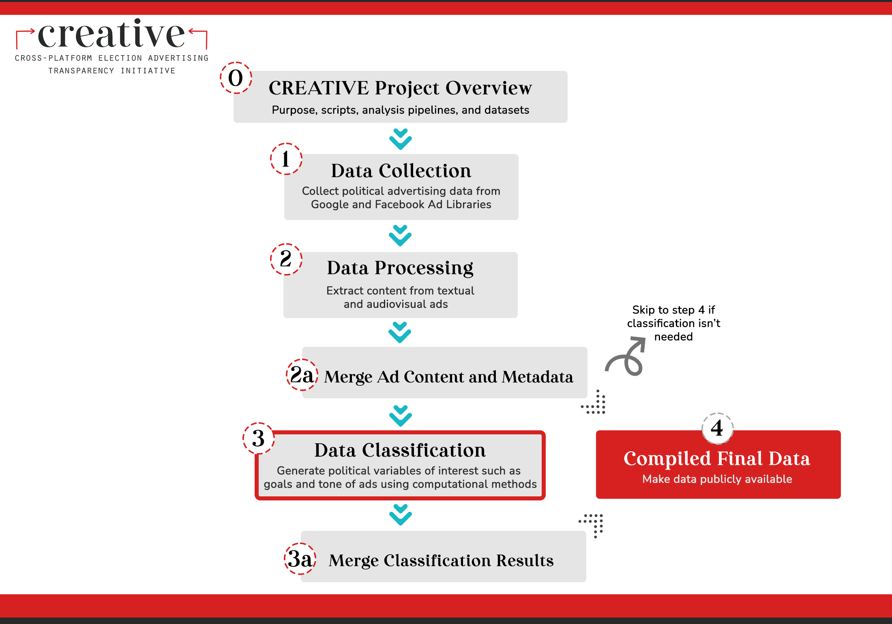

# CREATIVE --- Issue Classifier

Welcome! This repo contains scripts for classifying issues in political ads that are trained on hand-coded 2018 and 2020 advertising data.

This repo is part of the [Cross-platform Election Advertising Transparency Initiative (CREATIVE)](https://www.creativewmp.com/). CREATIVE is an academic research project that has the goal of providing the public with analysis tools for more transparency of political ads across online platforms. In particular, CREATIVE provides cross-platform integration and standardization of political ads collected from Google and Facebook. CREATIVE is a joint project of the [Wesleyan Media Project (WMP)](https://mediaproject.wesleyan.edu/) and the [privacy-tech-lab](https://privacytechlab.org/) at [Wesleyan University](https://www.wesleyan.edu).

To analyze the different dimensions of political ad transparency we have developed an analysis pipeline. The scripts in this repo are part of the Data Classification step in our pipeline.



## Table of Contents

- [1. Overview](#1-overview)
- [2. Setup](#2-setup)
- [3. Results Storage](#3-results-storage)
- [4. Thank You](#4-thank-you)

## 1. Overview

The issue classifier, trained on 2022 ads - Meta, Google, and TV - is designed to be applied to uncoded 2022 ads. It is based on issues as coded by the WMP. In total, we code ads into 25 different issue categories based on which issue an ad is focused on.

These 25 issues were the top 25 issues that appeared in 2022 election advertising on TV, identified by the Wesleyan Media Project. 
<!-- To decide which issues to classify, we looked at which issues occurred at least 100 times in the TV data, and excluded two (Issue 116 and 209) that were problematic. So we have 65 issues. For a list of the issues of interest, see [this spreadsheet](https://github.com/Wesleyan-Media-Project/issue_classifier/blob/main/data/issues_of_interest.csv).
 -->
## 2. Setup

**NOTE**: Some parts of the data in the datasets repo include TV data. In particular, files in this repo numbered 01 through 21 use TV data. Due to contractual reasons users must apply directly to receive raw TV data. Fill out the [online request form](http://mediaproject.wesleyan.edu/dataaccess) to request access to TV datasets.

### 2.1 Install R and Packages

1.  First, make sure you have R installed. While R can be run from the terminal, many people find it easier to use RStudio along with R. Here is a [tutorial for setting up R and RStudio](https://rstudio-education.github.io/hopr/starting.html). The scripts are tested on R 4.0, 4.1, 4.2, 4.3, and 4.4.

2.  Next, make sure you have the following packages installed in R (the exact version we used of each package is listed in the [requirements_r.txt file](https://github.com/Wesleyan-Media-Project/issue_classifier/blob/main/requirements/requirements_r.txt). These are the versions we tested our scripts on. Scripts may also work with other versions, but we cannot ensure this). You can install the specific versions by calling:

    ```R
    install.packages("remotes")

    install_version("data.table", version="1.15.4")
    install_version("stringr", version="1.5.1")
    install_version("stringi", version="1.7.12")
    install_version("haven", version="2.5.4")
    install_version("dplyr", version="1.1.4")
    install_version("tidyr", version="1.3.1")
    ```

    Or you can install the most recent versions of each package by running:

    ```R
    install.packages('data.table')
    install.packages("stringr")
    install.packages("stringi")
    install.packages("haven")
    install.packages("dplyr")
    install.packages("tidyr")
    ```

3.  In order to successfully run each R script you must first set your working directory. The working directory is the location on your computer that R will use for reading and writing files. You can do so by adding the line `setwd("your/working/directory")` to the top of the R scripts, replacing `"your/working/directory"` with your actual working directory. You must make sure that your working directory is in agreement with the paths to where any input files exist and where output files will be created.

    For instance, in script `code/prepare_train_fb22.R` the input and output are written as follows:

    ```R
    # Input data
    path_input_data <- "../../datasets/facebook/FBEL_092924.dta"
    # Output data
    path_output_data <- "../data/fb_2022.rdata"
    ```

    If you do not wish to change either of these paths, your working directory should be set as follows:

    ```R
    setwd("/local/path/to/issue_classifier/")
    ```

    where `/local/path/to/` represents the location at which the ad_goal_classifier folder resides on your computer. Meanwhile, you need to download the [`datasets` repo](https://github.com/Wesleyan-Media-Project/datasets) into the same parent folder where `issue_classifier` is stored. 

4.  In order to execute an R script you can run the following command from your terminal from within the directory of the script replacing `file.R` with the file name of the script you want to run:

    ```bash
    Rscript file.R
    ```

### 2.2 Install Python and Packages

1. First, make sure you have [Python](https://www.python.org/) installed. The scripts are tested on Python 3.9 and 3.10.

2. In addition, make sure you have the following packages installed in Python (the exact version we use for each package is listed in the [requirements_py.txt file](https://github.com/Wesleyan-Media-Project/issue_classifier/blob/main/requirements/requirements_py.txt). These are the versions we tested our scripts on. Scripts may also work with other versions, but we cannot ensure this). You can install by running the following command in your terminal:

   ```bash
   pip3 install pandas==2.2.2
   pip3 install scikit-learn==1.0.2
   pip3 install numpy==1.26.4
   pip3 install joblib==1.4.2
   pip3 install torch==2.3.1
   pip3 install tqdm==4.66.4
   pip3 install transformers==4.41.2
   pip3 install datasets==2.20.0
   ```

3. We recommend creating and activating a Python virtual environment before running the .py and .ipynb scripts. We create it using Python 3.10 since the scripts have been previously tested with this version:

   ```bash
   python3.10 -m venv venv
   source venv/bin/activate
   ```

   If you want to stop the virtual environment at some point, you can deactivate it:

   ```bash
   deactivate
   ```

4. In order to execute a Python script you can run the following command from your terminal from within the directory of the script replacing `file.py` with the file name of the script you want to run:

   ```bash
   python3 file.py
   ```

### 2.3 Install Jupyter Notebook

1. Some of our scripts use the Jupyter Notebook as Python user interface. Thus, you need to install it to run any script with the `.ipynb` extension. You can install Jupyter Notebook using the following command in your terminal:

   ```bash
   pip install jupyter
   ```

2. Start Jupyter Notebook using the following command in your terminal:

   ```bash
   jupyter notebook
   ```

### 2.4 Training

**NOTE**: If you do not want to train a model from scratch, you can use the trained model with multi-label classification we provide. Since this model is too large, only a part of it is included in this repo [here](models/multilabel_trf_v4/config.json). For the other part, you will need to download it from [Figshare](https://www.creativewmp.com/data-access/). Please note that to access the data stored on Figshare, you will need to fill out a brief form and will then immediately get data access. Make sure to download it to the same directory with the other part of the model. Keep in mind that we only provide the trained model for multi-label classification.

Given that an ad can have multiple issues - or none - there are two basic approaches. One is to use a binary classifier for each issue separately. The other is to use a multi-label classifier which processes all issues together. Binary classifiers tend to have higher precision but lower recall, while multi-label classifiers tend to have lower precision and higher recall. Multi-label classifiers generally tend to have higher F1 scores. All measures noted here are only for the positive instances (1s) of each class as predicting the negative instances (0s) would yield a 97-98% score due to the overwhelming presence of negative instances.

Although we provide scripts for both binary and multi-label classifications, we recommend the multi-label classifier as it provides higher accuracy. For the final model to be used for inference we use a transformer-based multi-label model, mostly based on the [code](https://dataverse.harvard.edu/dataset.xhtml?persistentId=doi:10.7910/DVN/C9SAIX) by a recent [Political Analysis article](https://www.cambridge.org/core/journals/political-analysis/article/creating-and-comparing-dictionary-word-embedding-and-transformerbased-models-to-measure-discrete-emotions-in-german-political-text/2DA41C0F09DE1CA600B3DCC647302637#article). We utilized only the training scripts (e.g., trainer setup, performance report, etc.) from this article for our own purposes. We only utilize their model training structure and not their training data since that paper is using text data in German to train a text classifier. Additionally, we use the DistilBERT model from Huggingface instead of the model provided by that article (e.g., German Electra) to avoid any issues with domain knowledge and language.

To train the models, run the scripts in our `code` directory. 
- [prepare_train_fb22.R](code/prepare_train_fb22.R), [prepare_train_g22.R](code/prepare_train_gg22.R) & [prepare_train_tv22.R](code/prepare_train_tv22.R): These scripts merge manually coded issue labels and (cleaned up) ad content for Meta, Google and TV ads respectively.
- [prepare_train_merge_tv_fb_gg.R](code/prepare_train_merge_tv_fb_gg.R): This script merges Meta, Google, and TV 2022 ad content and issue labels into a dataset for training, validation and test.
- [train_binary_rf.py](code/train_binary_rf.py): This script trains a binary classification model for each issue separately. Thus, if you run this, you will have 25 models, one for each issue. We use Random Forest Classification.
- [train_multilabel_trf_v4.py](code/train_multilabel_trf_v4.py): This script trains a multilabel classification model. We use a DistilBERT model from Huggingface for training. Due to having 25 categories and a large text data, this training could take days with a CPU. For context, we used a NVIDIA Tesla P100 GPU with 16GB of memory which took over three hours.

The model performances for both binary and multilabel models are located [here](performance).

### 2.5 Inference

Once you have the trained model, you can run the inference for Facebook and Google 2022 data. Both [Facebook](fb_2022) and [Google](google_2022) have their own folders for their inference scripts. Scripts are numbered in the order that they should be run.

For Facebook 2022:

- [01_f2022_prep.R](code/inference_fb_2022/01_f2022_prep.R): This prepares the inference data. You will need the [`fb_2022_adid_text.csv.gz`](https://www.creativewmp.com/data-access/) data which can be downloaded from Figshare. Please note that to access the data stored on Figshare, you will need to fill out a brief form and will then immediately get data access.
- [02_fb2022_inf_multilabel.ipynb](code/inference_fb_2022/02_fb2022_inf_multilabel.ipynb) & [02_fb2022_inf_binary.ipynb](code/inference_fb_2022/02_fb2022_inf_binary.ipynb): These scripts carry out the classification task. The first does the classification using multilabel model while the second classifies data using the binary models.
- [03_fb2022_post_process.ipynb](code/inference_fb_2022/03_fb2022_post_process.ipynb): This script processes the output data from the previous step. In particular, it combines the all detected issues for a given ad into one column.

For Google 2022:

- [01_g2022_prep.R](code/inference_google_2022/01_g2022_prep.R): This prepares the inference data. You will need the [`g2022_adid_text.csv.gz`](https://www.creativewmp.com/data-access/) data which can be downloaded from Figshare. Please note that to access the data stored on Figshare, you will need to fill out a brief form and then immediately will get data access.
- [02_g2022_inf_multilabel.ipynb](code/inference_google_2022/02_g2022_inf_multilabel.ipynb) & [02_g2022_inf_binary.ipynb](code/inference_google_2022/02_g2022_inf_binary.ipynb): These scripts carry out the classification task. The first does the classification using multilabel model while the second classifies data using the binary models.
- [03_g2022_post_process.ipynb](code/inference_google_2022/03_g2022_post_process.ipynb): This script processes the output data from the previous step. In particular, it combines the all detected issues for a given ad into one column.

## 3. Results Storage

The data created by the scripts in this repo is in `csv` format and located [here](data).

## 4. Thank You

<p align="center"><strong>We would like to thank our supporters!</strong></p><br>

<p align="center">This material is based upon work supported by the National Science Foundation under Grant Numbers 2235006, 2235007, and 2235008. Any opinions, findings, and conclusions or recommendations expressed in this material are those of the author(s) and do not necessarily reflect the views of the National Science Foundation.</p>

<p align="center" style="display: flex; justify-content: center; align-items: center;">
  <a href="https://www.nsf.gov/awardsearch/showAward?AWD_ID=2235006">
    
  </a>
</p>

<p align="center">The Cross-Platform Election Advertising Transparency Initiative (CREATIVE) is a joint infrastructure project of the Wesleyan Media Project and privacy-tech-lab at Wesleyan University in Connecticut.

<p align="center" style="display: flex; justify-content: center; align-items: center;">
  <a href="https://www.creativewmp.com/">
    
  </a>
</p>

<p align="center" style="display: flex; justify-content: center; align-items: center;">
  <a href="https://mediaproject.wesleyan.edu/">
    
  </a>
</p>

<p align="center" style="display: flex; justify-content: center; align-items: center;">
  <a href="https://privacytechlab.org/" style="margin-right: 20px;">
    
  </a>
</p>
`````
